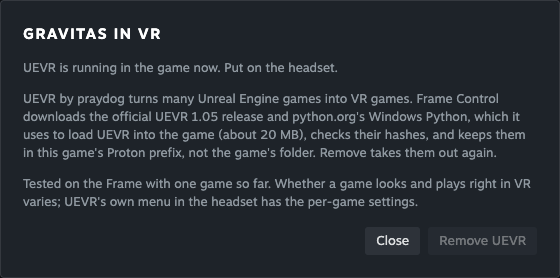

# Flat-to-VR mods and Beat Saber songs

**Status: UEVR works from Frame Control for Unreal Engine games; Beat Saber
songs are blocked.** Installed games have a **VR mod** button. It installs
UEVR, starts the game with UEVR injected, and removes UEVR again. That whole
loop was run on a real Frame on 2026-09-29 with Gravitas, from the app's own
UI ([evidence](evidence/mods-2026-09-29.md)). The headset was unworn, so
the VR image, head tracking and controls haven't been seen yet. Beat Saber
custom songs need an owned Beat Saber on the Frame, which there isn't
([below](#beat-saber-songs-first)).
[Issue #26](https://github.com/saphid/frame-control/issues/26) stays open for those.

The mod manager must be Frame Control's own implementation. Mods and songs
are permitted third-party content; BSManager, ModsBeforeFriday, MO2 and other
managers must not be dependencies. Steam, Proton and SteamVR remain platform
dependencies. No game purchases, entitlement bypasses, withdrawn builds or
unofficial mod mirrors are part of this work.

## Per-game support

Checked 2026-09-28 and 2026-09-29 on SteamOS **0.4.1**, BUILD_ID
**20260925.6191901**, aarch64, with **Proton 11.0-2c ARM64** and SteamVR **2.18.1**. “Verified” describes only
the observation stated, not a promise that the game is playable. “Documented”
means an upstream source describes it; “inferred” means it still needs a test.

| Game / build | Mod or content | Evidence and support status | Next check |
|---|---|---|---|
| Half-Life 2: VR Mod – Episode One, Steam 2177750, build 25413453 | Official Steam community mod, shared base depot 658920 build 25413418 | **Verified: startup only.** Already installed; launched through Proton ARM64. The stereo headset capture showed its first-time setup, and SteamVR loaded `bindings_frame.json`. Gameplay, controller interaction, fresh installation and removal are unverified. | Complete first-time setup and play a level before offering a tested install shortcut. |
| Gravitas, Steam 1067310, Windows, Unreal Engine 4 | UEVR 1.05, from Frame Control | **Verified 2026-09-29: installs, injects, SteamVR receives frames, removes cleanly.** Twelve cold **Play in VR** runs (33–35 s each), and the full cycle from the app's UI, all loaded `UEVRBackend.dll` into the game, with UEVR logging `Hooked DirectX 11` and `Requested runtime: openvr_api.dll`. SteamVR's compositor counted frame submits for `steam.app.1067310`. Remove restored the prefix to its pre-install file listing. **Not seen:** the stereo image, head tracking and controls (headset unworn). | Wear the headset: check the image, tracking, UEVR's in-headset menu and controller input. |
| Beat Saber, Steam 620980, Windows / Proton | Basic custom songs; later SongCore and version-matched mods | **Verified: absent from the 868-game library returned by this Frame.** Store metadata lists Windows, not Linux. **Documented:** the PC game reads basic maps from `Beat Saber_Data/CustomLevels` without a mod manager. Playback on Frame is unverified. | An already-owned, legitimately installed copy is required. Do not buy it as part of this task. |
| Beat Saber, claimed native ARM64 build | Custom songs / native mods | **Inferred: unverified.** The research mentions this build but supplies no verified official distributable or tested layout. CPU architecture alone does not identify Android versus Linux, the game version or the mod ABI. | Establish official provenance, ownership, binary type and version before touching files. Do not apply Quest patches to an unidentified build. |
| Beat Saber, Alex's Quest 2 copy | Custom songs / Android mods | **Documented: owner-reported copy on Quest 2.** Not reachable on 2026-09-29 (no device on `adb` from the Mac). No APK, version or installed mods inspected; no Frame playback verified. A Quest copy is a Meta store purchase; copying it to another headset would need its entitlement check to pass there, which this work won't work around. This does not establish ownership of the Steam build. | When the Quest is available, inspect the owned copy's version and supported transfer path, then test Lepton/OpenXR compatibility without bypassing entitlement checks. |
| Hogwarts Legacy, Steam 990080 | R.E.A.L. | **Verified: listed in this Frame's owned library, not installed.** Official release access and redistribution permission were not established; the referenced author Patreon page returned HTTP 403. No archive downloaded or game tested. | Obtain a current free release from the author and confirm its terms before any test. A news report saying “free” is not a redistribution grant. |
| Horizon Zero Dawn, Steam 1151640; Horizon Forbidden West, Steam 2420110 | R.E.A.L. | **Verified: both listed as owned, neither installed.** Same source/permission blocker as above; runtime support is unverified. | Check each game's supported version against an accessible official release. |
| Half-Life 2 VR / other OpenVR games | OpenComposite, per-game replacement | **Documented:** forwards OpenVR calls to OpenXR. **Inferred: Frame compatibility unknown.** Not installed or tested. HL2 VR reached setup with the shipped OpenVR path already. | Test a specific game and replacement DLL only if needed; preserve its original DLL. Never switch the shared headset's runtime globally. |
| Doom / Quake / Half-Life Team Beef ports | Author's VR ports plus separately owned or free game data | **Inferred: untested.** Android ARM64 support does not establish OpenXR extension or controller compatibility on Lepton. | Choose an official release and legally usable data set, then test that exact port. |
| Skyrim VR, Steam 611670 | SKSEVR / HIGGS / PLANCK stack | **Verified: Skyrim VR is absent from this library.** Owning flat Skyrim or Special Edition is not the VR game's entitlement. Runtime and mod support are unverified. | An already-owned VR copy and version-matched official mod releases are required. |

The test records ([2026-09-28](evidence/mods-2026-09-28.md),
[2026-09-29](evidence/mods-2026-09-29.md)) distinguish process startup,
visible output, injection and failures.

## UEVR from Frame Control

**Get games → an installed game → VR mod.** The dialog says whether the game
can take UEVR, then offers **Install UEVR**, **▶ Play in VR** and **Remove
UEVR**. The server route is `POST /api/mods {"action": "status" | "install" |
"start" | "uninstall", "appid": …}`, and the work happens on the Frame in
[`ui/frame_mods.py`](../ui/frame_mods.py). It uses only the standard library,
like `frame_steam.py`.

- **Which games.** Unreal Engine games, recognised by their
  `…/Binaries/Win64/*-Win64-Shipping.exe` (inferred as the general rule; checked
  with Gravitas, and HL2 VR is correctly refused). The game needs a Proton
  prefix, so it must have been played once.
- **Install.** Downloads praydog's [UEVR 1.05 release](https://github.com/praydog/UEVR/releases/tag/1.05)
  and python.org's [Windows x64 embeddable Python 3.14.7](https://www.python.org/downloads/release/python-3147/).
  Each is checked against a pinned SHA-256; Python's comes from python.org's
  release-file API. Archives are unpacked into a staging folder, rejecting
  entries that escape it, symlinks and oversized contents, then moved into
  `<prefix>/drive_c/frame-control/` (about 47 MB). Nothing goes into the
  game's own folder. A receipt in `~/.local/share/frame-control/mods/` lists
  what to remove, including UEVR's own settings folders only if they didn't
  exist before. Install and remove refuse while the game is running, and only
  one mod action runs at a time.
- **Play in VR.** Launches the game through Steam if it isn't running and
  waits for its window. It then runs a short script under that Python, with
  the game's Proton, prefix and Wine settings read from the game process, so
  both share one Wine session. The script repeats what UEVR's own injector does
  when you press Inject with OpenVR chosen: load `UEVRPluginNullifier.dll` and
  call its `nullify`, load `openvr_api.dll`, set `Frontend_RequestedRuntime` in
  UEVR's per-game `config.txt`, then load `UEVRBackend.dll`. Each load is a
  `LoadLibraryW` remote thread, as in the frontend's `Injector.cs`. `start`
  then checks that `UEVRBackend.dll` is mapped into the game and reads
  SteamVR's frame count for the app (`vrcmd --stats`).
- **Remove.** Deletes what the receipt lists, then the download cache once
  no game uses it. Verified: the prefix's file listing matched its
  pre-install state afterwards.

Why not UEVR's own injector (verified 2026-09-29):

- It's a .NET 6 WPF app, so it needs Microsoft's .NET runtimes (about 70 MB
  of downloads) in the prefix.
- Under gamescope, the full-screen game keeps the pointer and focus. XTest
  clicks, raising or refocusing the injector window don't change that, so in
  the headset you can't click it. Sending X `ButtonPress`/`ButtonRelease`
  events straight to its window does work.
- `--attach=<process>` didn't inject under Wine, and it didn't restore its
  saved OpenVR choice.
- Driven that way, it injected in 6 of 8 cold starts. In a bad session every
  new injector ignored input or never showed its window, even after
  relaunching. Its process list reads each process's main window title, a
  cross-process window message; a window that isn't answering would block its
  UI thread (inferred from the frontend's source, not proven). Without a
  `HOME` it also died in .NET at startup.
- Frame Control's own script injected in 12 of 12 cold starts through the API, in 33–35 s, and again from the UI.
- UEVR's DirectX 12 probing logs errors before it settles on DirectX 11 for
  Gravitas, and some of its Unreal engine scans fail on this older UE4 game.
  Neither stopped the injection.

## Beat Saber: songs first

**Documented:** the [BSMG PC guide](https://bsmg.wiki/pc-modding.html)
describes extracting each map into its own directory below
`Beat Saber/Beat Saber_Data/CustomLevels`. Basic custom songs do not require
SongCore; maps that require mod features need their matching dependencies.
This is a candidate for our own file manager, not a verified Frame feature.

Alex's Quest 2 copy is a separate Android candidate. Its ownership does not
make the PC `CustomLevels` layout applicable. Until the actual build is
inspected, neither a direct song-copy recipe nor APK patching is justified.

Only maps whose music and chart are permitted for distribution may be used
as test fixtures or bundled content. A public download alone does not establish
those rights. Start with an original or explicitly licensed basic map.

**Documented:** [ModsBeforeFriday](https://github.com/Lauriethefish/ModsBeforeFriday)
targets Quest Beat Saber over WebUSB/ADB. It is not a generic native ARM64
modding protocol. [BSManager](https://github.com/Zagrios/bs-manager/releases/tag/v1.6.0)
publishes an aarch64 Flatpak, but its architecture says nothing about Beat
Saber or its plugins running on Frame. Neither app is an installation step
or dependency for Frame Control.

## Requirements for our manager

For UEVR, items 1–5 are implemented in `frame_mods.py` and covered by
fake-library tests (`tests/test_mods.py`), apart from checking ownership
through Steam; item 6 is met for Gravitas. Beat Saber songs would need the
same, and none of it is built for them:

1. Resolve the selected Steam game's real library, installed build, executable
   architecture and Proton prefix. Confirm ownership through Steam; a directory
   or app manifest alone is not proof. Keep downloading, installed and playable
   as separate states.
2. Download a pinned mod version from the author's official release. Record
   the URL, version, license and digest. Verify the published digest when
   available; an upstream SHA-256 detects corruption but is not a signature.
   Do not treat “free to download” as permission to redistribute.
3. Stage and validate archives before writing into the game or prefix. Reject
   path traversal, links escaping the destination, archive bombs and unexpected
   executable content in song packs. Check song metadata and its referenced
   files, not just the `.zip` suffix.
4. Refuse changes while the game is running. Back up originals and journal
   every managed file and digest. Apply changes atomically where possible and
   roll back partial failures. Keep runtime prerequisites scoped to this game.
5. Uninstall only files still matching our receipt; restore originals without
   overwriting later user edits. Preserve saves, unrelated mods and songs.
   Song removal must target one managed map, never the whole CustomLevels tree.
6. Expose one-click actions beside the game only after real-Frame install,
   playback and uninstall pass. Test filesystem and download failure handling
   with fake-Frame fixtures; those cannot prove FEX injection or VR rendering.

## Sources

- [UEVR 1.05 official release](https://github.com/praydog/UEVR/releases/tag/1.05)
  and [author's usage instructions](https://github.com/praydog/UEVR#getting-started).
- [Microsoft .NET 6 release metadata](https://builds.dotnet.microsoft.com/dotnet/release-metadata/6.0/releases.json),
  including the SHA-512 hashes used for the injector tests.
- [UEVR frontend source](https://github.com/praydog/UEVR-Frontend): `UEVR/MainWindow.xaml.cs`
  (`Inject_Clicked`) and `UEVR/Injector.cs`, the steps `frame_inject.py` follows.
- [python.org release-file API](https://www.python.org/api/v2/downloads/release_file/) for the
  embeddable Python's `sha256_sum`.
- [OpenComposite's OpenXR branch](https://gitlab.com/znixian/OpenOVR/-/tree/openxr),
  including per-game installation and the need to preserve original DLLs.
- [R.E.A.L. author post referenced by the research](https://www.patreon.com/realvr/posts/but-wheres-link-165840151)
  (HTTP 403 from this environment; contents not verified).
- [Half-Life 2 VR official site](https://halflife2vr.com/) and
  [Episode One on Steam](https://store.steampowered.com/app/2177750/).
- [Beat Saber store metadata](https://store.steampowered.com/api/appdetails?appids=620980).
