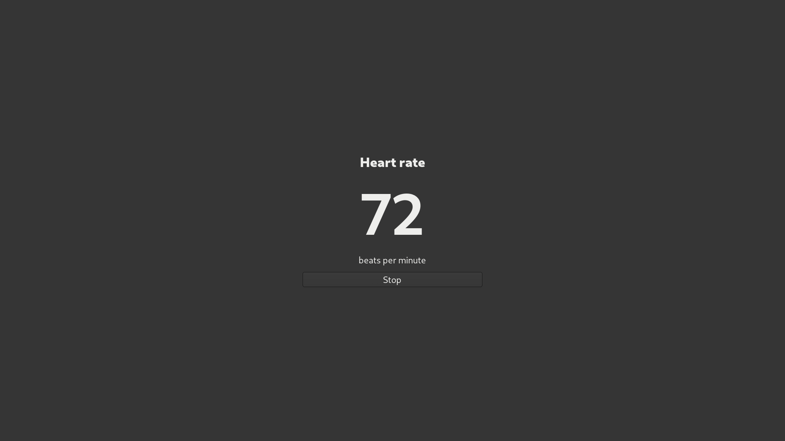

# Eye tracking and heart rate

Frame Control's own tools run on the Frame, using OpenXR and BlueZ. No
VRCFaceTracking, LunaHR, Pulsoid or other tracking app is required. This is a
command-line first version; it does not add a desktop app tab.

## What was checked

**Verified 2026-09-28**, on a real aarch64 Frame running SteamOS 0.4.1,
BUILD_ID `20260925.6191901`:

| Check | Result |
|---|---|
| OpenXR gaze | SteamVR advertises `XR_EXT_eye_gaze_interaction`, `XR_MND_headless` and `XR_KHR_convert_timespec_time`. `supportsEyeGazeInteraction=1`. A headless session reached FOCUSED and produced 269 valid, tracked orientations in the first ten-second probe. |
| Our gaze → OSC bridge | A separate ten-second run produced 280 valid samples and 280 correctly padded 44-byte `/tracking/eye/CenterPitchYaw` messages at an explicitly configured loopback receiver. Only counters and packet-layout checks were retained. |
| Bluetooth stack | BlueZ active, adapter powered, central/peripheral roles available. LE discovery started and stopped successfully. No pairing or adapter power settings changed. |
| Our heart-rate panel | GTK4/GI runs on the stock image. A **synthetic 72 BPM** notification displayed in our X11 window, tagged `STEAM_GAME=2000000027`. Window capture checked; no real heart-rate measurement was taken. |
| SlimeVR, separate feasibility check | Native aarch64 server v21.1.0 ran with an isolated Temurin 21 JRE, created its driver sockets and accepted a local TCP connection on port 21110. Driver v6.0.0 loaded with all shared libraries resolved; `HmdDriverFactory("IServerTrackedDeviceProvider_004")` returned a non-null provider and error 0. |



The image is a capture of our own Frame window using a fake notification,
not a real sensor reading.

**Untested:** a real BLE strap's notifications, physical fit/contact behaviour,
end-to-end heart-rate display/OSC/log with a strap, avatar response in VRChat,
gaze accuracy/calibration, coexistence with every immersive app, in-headset
panel placement, SlimeVR tracker/calibration data and the SlimeVR driver running
inside SteamVR. No trackers or strap are attached. The driver was loaded in a
separate process; it was **not registered or activated in SteamVR**. Steam and
SteamVR were not stopped or restarted.

**Verified blocker resolved:** importing `tkinter` fails because `libtk8.6.so`
is absent. The panel uses the installed GTK4/GI bindings instead. The Frame's
OpenXR headers advertise a newer API version than the runtime accepts; our
reader requests OpenXR 1.0 explicitly.

## Install our tools

From this checkout on your computer, while the Frame is awake:

```sh
python3 scripts/tracking-on-frame.py install
```

This copies our Python code and compiles our small C OpenXR reader into
`~/.local/share/frame-control/tracking/` on the Frame. It uses the Frame's
existing compiler, OpenXR headers/loader, Python, dbus-python, GI and GTK4.
Nothing is downloaded, and no sudo, driver registration, system setting,
service or autostart is added. `FRAME_ALIAS` can select another SSH alias.
The desktop app/server keeps its existing stdlib-only dependency set.

## Eye tracking → OSC

Start with a ten-second capability/data-availability check:

```sh
python3 scripts/tracking-on-frame.py gaze --seconds 10
```

This prints support, session-state numbers and sample counters. It opens no
OSC socket and prints no gaze coordinates. Exit 0 means at least one valid
sample, 3 means no valid sample was observed, and 1 means an API/runtime error.
If there are no valid samples, wake/wear the headset and check its tracking
setup; a successful capability check alone does not prove usable gaze.

To send to VRChat running **on the Frame**, explicitly enable OSC in VRChat
and choose its local UDP endpoint:

```sh
python3 scripts/tracking-on-frame.py gaze --seconds 3600 --osc 127.0.0.1 9000
```

For a receiver on another computer, replace `127.0.0.1` with that computer's
IP address and choose its listening port. Addresses are IP literals (IPv4 or
IPv6); there is no discovery or default destination. Loopback here always
means **the Frame**, not the computer running the SSH command. OSC uses
unencrypted UDP: configure only a receiver you intend to receive this data.

**Documented:** [VRChat's eye OSC interface](https://docs.vrchat.com/docs/osc-eye-tracking)
accepts `/tracking/eye/CenterPitchYaw` with two floats in degrees, positive down
and right. We locate OpenXR's combined gaze pose relative to VIEW (the head),
rotate its -Z forward vector and convert that direction to these angles.
Only active, orientation-valid **and tracked** samples are sent, at up to
30 Hz. No eyelid/blink, individual-eye or face values are invented. We do not
send neutral gaze on tracking loss; VRChat's documented timeout restores its
automatic eye behaviour after input stops.

**Privacy:** gaze is personal data. It stays in process memory and a private
pipe between our reader and bridge. There is no gaze log option, telemetry,
OSC receiver or raw gaze on stdout/stderr. Only an explicit `--osc IP PORT`
opens an output socket. Runtime diagnostics and validity counters are not
measurements. Stop with Ctrl-C or let `--seconds` expire (maximum 24 hours).
A lost headless session ends the run; it does not silently reconnect.

## BLE heart rate → our panel, OSC and optional log

First discover/pair your strap in SteamOS's Bluetooth settings. Select that
strap's Bluetooth address explicitly; our tool does not scan for or connect
to arbitrary nearby devices.

```sh
python3 scripts/tracking-on-frame.py heart \
  --device AA:BB:CC:DD:EE:FF --panel --seconds 3600
```

This uses BlueZ's standard Heart Rate Service (`180d`) and Heart Rate
Measurement (`2a37`) notifications. It finds the characteristic only beneath
the selected device's HRS service. The reader handles 8- and 16-bit BPM,
contact flags and optional energy/RR fields; energy and RR intervals are
validated for length but discarded. Zero BPM, reported loss of skin contact,
malformed packets and readings older than five seconds are not shown as a
current measurement. A disconnect stops the run; reconnect and start again.
This is a social/fitness readout, not a medical monitor.

The panel is our GTK4 window on gamescope's X display. Use SteamVR's panel
controls to float/dock it (see [panels](panels.md)). **Stop**, closing the panel,
Ctrl-C, SSH hangup or the duration limit ends our subscription. A connection
that was already open when we started is preserved; a connection we opened
is disconnected on exit. No Bluetooth power or pairing state is changed.

Add either output explicitly:

```sh
python3 scripts/tracking-on-frame.py heart \
  --device AA:BB:CC:DD:EE:FF --panel --seconds 3600 \
  --osc 127.0.0.1 9000 --address /avatar/parameters/HeartRate \
  --log /home/steamos/heart-session.csv
```

The OSC value is integer BPM. `HeartRate` is a chosen avatar parameter, **not a
built-in VRChat heart-rate feature**; your avatar/receiver must define the
matching parameter. `--address` can select another literal OSC path. The local
panel works without OSC, a log or an avatar integration.

The optional CSV contains only `unix_seconds,bpm`. It is created privately
(mode 0600), refuses existing files/symlinks, and lives **on the Frame** at the
path you specify. Nothing is logged by default, and heart-rate values are not
printed to the terminal. Delete your session file when you no longer need it.

## SlimeVR: feasibility only

SlimeVR is an independent application stack. Neither of our features installs,
launches or depends on it. Users who want it can follow
[SlimeVR's setup documentation](https://docs.slimevr.dev/server/index.html).
The consented upstream releases tested were
[server v21.1.0](https://github.com/SlimeVR/SlimeVR-Server/releases/tag/v21.1.0)
and [driver v6.0.0](https://github.com/SlimeVR/SlimeVR-OpenVR-Driver/releases/tag/v6.0.0),
under SlimeVR's MIT/Apache-2.0 licensing.

**Verified layout, read-only:** the Frame's registered runtime is `/opt/steamvr`;
its native driver is `drivers/cv/bin/linuxarm64/driver_cv.so`, with a
`drivers/cv/driver.vrdrivermanifest`. Frame controller manifests/resources are
under `drivers/frame_controller/`. Configuration is under
`~/.config/openvr/config/`, not the Steam client's config directory. The
SlimeVR release also uses `slimevr/bin/linuxarm64/driver_slimevr.so` plus its
manifest. Nothing in those installed SteamVR directories was changed.

**Inferred:** the matching ABI/layout and standalone factory success make
SteamVR integration plausible. They do not prove successful driver `Init`,
server/driver IPC, tracking, or calibration. That needs a separate integration
check with hardware and an agreed SteamVR restart. No Java executable was on
PATH for this check, so an isolated JRE was used. SlimeVR's server opens LAN
listeners; our temporary server was stopped and the temporary downloads,
configuration and logs were removed. It is not left installed or running.

## Tests and remaining checks

```sh
python3 -m unittest discover -s tests
```

`tests/test_tracking.py` covers HRS packet parsing, contact/staleness, OSC
padding/types and a real loopback socket, quaternion signs, opt-in networking,
private/exclusive logging and a fake BlueZ object tree. The fake checks service
ownership, notification routing, delayed GATT discovery and connection cleanup.
It does not pretend to be a physical strap or a real OpenXR runtime.

Before calling hardware support complete, attach a strap and check BPM against
its own display/reference, loss of contact, disconnect/reconnect, Stop, OSC and
CSV together. Check avatar eyes while looking up/down/left/right in a supported
VRChat session. No third-party tracking app is needed for either test.

Independent review attempt: `devin -p --model swe-2-max` with the frozen diff,
contribution standards and read-only instructions returned no output for ten
minutes. It was terminated with exit 143. No completed review or actual model
identity was returned; hardware checks and independent review remain follow-up
work before making the draft ready.
